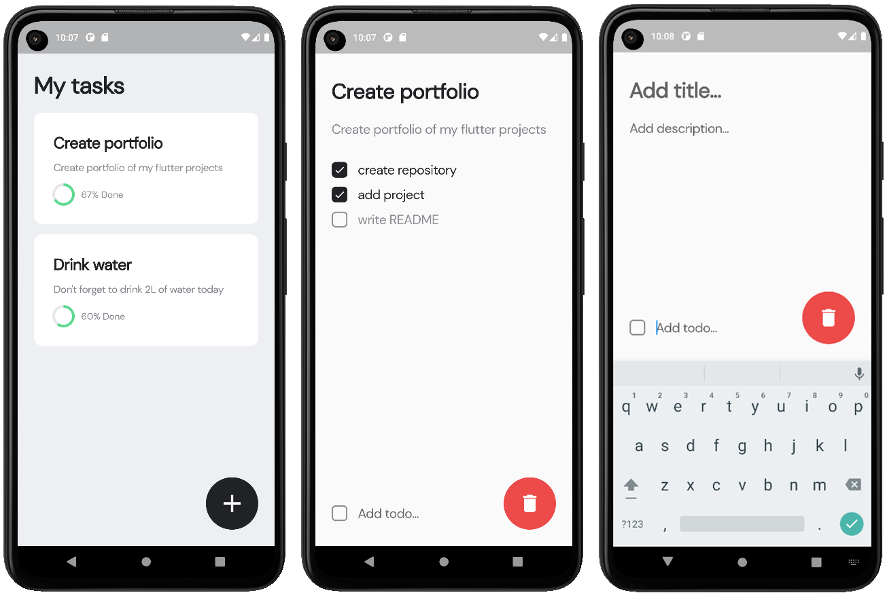

# Todo App

It's a simple app where you can add your tasks, give it some title, description and some checkboxes, so you can see your progress in each step.

## Story

This app is build as part of my personal Flutter Developer portfolio. This app shows my skills in:

 1. Usage of different built-in stateless/statefull widgets and making my own custom responsible widgets with fields;
 2. Internal database management with SQFlite;
 3. Integration model into different widgets.
 
## Use cases
 
Using this app you can:

 1. Add your tasks, give them titles, descriptions and checkboxes;
 2. Check your progress, that is calculated based on checked checkboxes;
 3. Delete your tasks.

